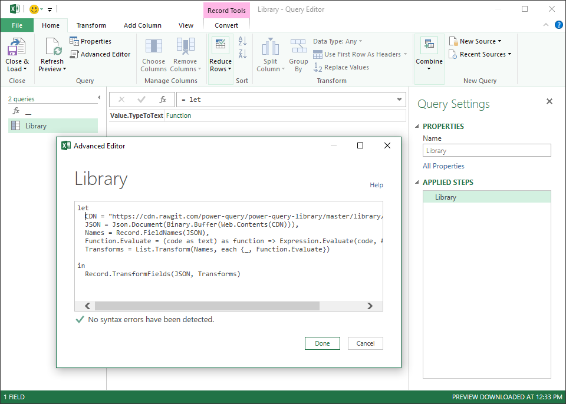
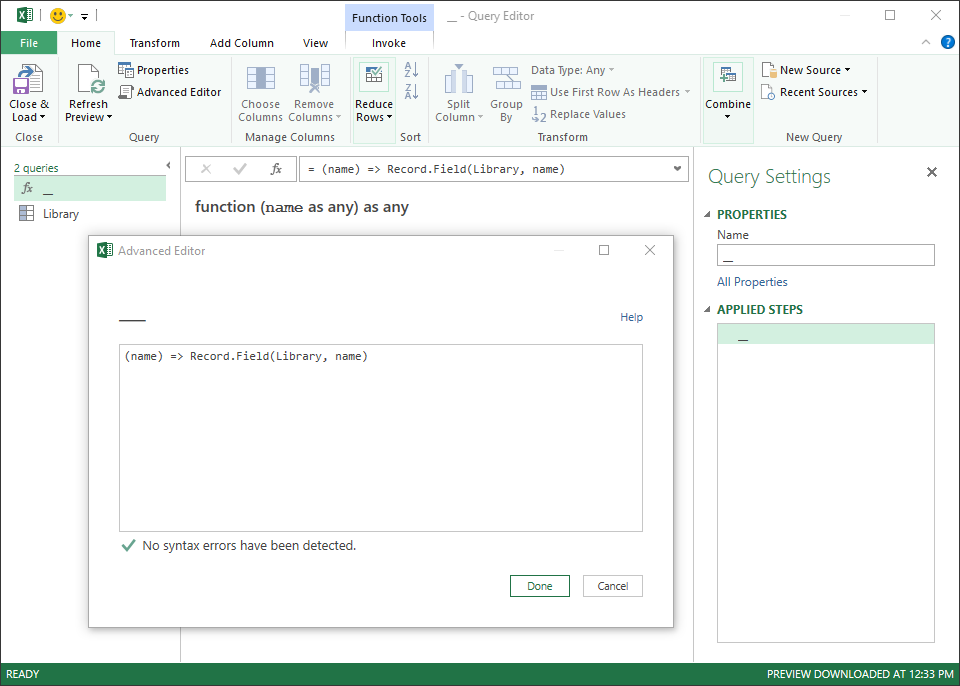
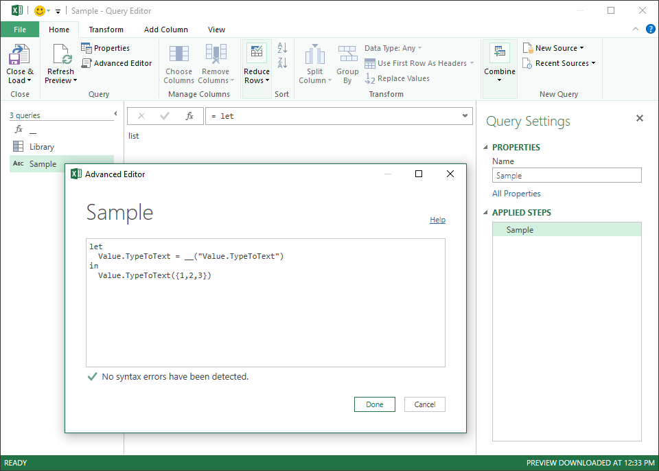

# About
Microsoft Power Query library for most popular API

# How to use
## Connecting library and functions-loader in Excel or Power BI
##### Library connection

1. Create Blank Query and name it "Library" (with a capital letter).
2. Copy and paste the code below through the Advanced Editor.

```jsx
let
  CDN = "https://rawgit.com/power-query/power-query-library/master/library/library.json",
  JSON = Json.Document(Binary.Buffer(Web.Contents(CDN))),
  Names = Record.FieldNames(JSON),
  Function.Evaluate = (code as text) as function => Expression.Evaluate(code, #shared),
  Transforms = List.Transform(Names, each {_, Function.Evaluate})

in
  Record.TransformFields(JSON, Transforms)
```


> **NOTE!**
>
> CDN-link to the library may change in the near future. If you encounter an error *"DataSource.Error: Web.Contents failed to get contents"* in Power Query, please go to this page for the renew your code.




##### Library functions-loader connection

1. Create Blank Query and name it "__" (double underscore).
2. Copy and paste the code below through the Advanced Editor.

```jsx
(name) => Record.Field(Library, name)
```


> Thanks [tycho01](hhttps://github.com/tycho01 "tycho01 github homepage") for the loader idea :)

## Using the library functions in Excel or Power BI

Connect as necessary library functions in your Queries as shown in the example below.
```jsx
let
  Value.TypeToText = __("Value.TypeToText")
in
  Value.TypeToText({1,2,3})
```
Also, you can call library functions without prior declaration, like so:
```jsx
__("FunctionName")(arguments)
```

